# sdk-privacy-scan

[English](./README.md) • **한국어**

[](https://www.npmjs.com/package/sdk-privacy-scan)
[](https://github.com/sunwoo05091/mobile-sdk-privacy-scan/actions/workflows/ci.yml)
[](./LICENSE)
[](package.json)

**락파일만으로 앱스토어 개인정보 신고서를 만들어냅니다.**
React Native / Flutter 프로젝트를 한 번 스캔하면 → Apple `PrivacyInfo.xcprivacy`,
App Store Connect 답안지, Google Play 데이터 보안 **import용 CSV**가 나오고,
개인정보 수집이 몰래 늘어나면 CI가 실패합니다.
**완전 로컬 동작**: 업로드 없음, 백엔드 없음, 계정 없음.

```bash
npx sdk-privacy-scan ./my-app
```



---

## 왜 필요한가

애플과 구글은 앱에 들어있는 모든 서드파티 SDK의 데이터 수집을 신고하라고
요구합니다. 현실에서 그건 수십 개 벤더 문서를 손으로 뒤지는 일이고, 신고
누락은 가장 흔한 심사 리젝 사유 중 하나입니다(`ITMS-91053`). 이 도구는
기계적인 부분을 자동화하고, 사람만이 판단할 수 있는 지점을 정확히 짚어줍니다.

| | 수작업 | sdk-privacy-scan |
| --- | --- | --- |
| pub / npm / pods / gradle 전 레이어에서 SDK 찾기 | 몇 시간 | 스캔 한 번 |
| SDK별 수집 데이터 파악 | 벤더 문서, 추측 | SDK가 **직접 배포한 매니페스트**를 그대로 읽음 |
| 애플 매니페스트 + ASC 답안 + Play CSV | 복사-붙여넣기 | 근거와 함께 자동 생성 |
| PR에서 수집 확대 감지 | 아무도 안 함 | 커밋된 베이스라인 + exit 1 |

## 동작 방식

```
락파일 ─▶ 탐지 ─▶ 수확 ─▶ 해석 ─▶ 생성 ─▶ 게이트
```

1. **탐지** — `pubspec.lock`, `package.json`, `ios/Podfile.lock`,
   `android/**/build.gradle` 전 레이어. 스캔 못 하는 레이어가 있으면
   (Expo managed, 락파일 부재) **커버리지 경고를 크게** 띄웁니다.
2. **수확(harvest)** — SDK가 패키지 안에 직접 배포한 `PrivacyInfo.xcprivacy`를
   찾아 파싱하고 소유 의존성에 귀속시킵니다. SDK 자신의 선언이 지식베이스를
   **대체**합니다 — 추측하지 말고, 읽는다.
3. **해석** — 나머지는 번들된 자동 검증 지식베이스와 대조합니다
   (SDK 50개, 그중 47개는 Apple 쪽 데이터를 실제 배포물에서 수확).
4. **생성** — 아래 산출물 4종. 증명 가능한 건 미리 채우고, 판단이 필요한
   모든 항목엔 `REVIEW` 표시.
5. **게이트** — 매니페스트 드리프트(`--compare`)와 수집 확대
   (`.privacy-baseline.json`)에서 exit 1.

## 산출물

| 파일 | 사용처 |
| --- | --- |
| `PrivacyInfo.xcprivacy` | Xcode 앱 타겟 (번들 매니페스트) |
| `app-store-connect-answers.md` | ASC → App Privacy 웹 설문 (import/API가 없는 영역) |
| `play-data-safety.csv` | Play Console → 앱 콘텐츠 → 데이터 보안 → **CSV 가져오기** |
| `play-data-safety.md` | 사람이 검토할 때 |

## 초안 그 이상

- **Required-reason API (`ITMS-91053`)** — UserDefaults·파일 타임스탬프·디스크
  용량을 쓰는 패키지를 자체 매니페스트와 교차 검증: ✓ 커버됨, 또는 직접
  선언해야 할 카테고리와 사유 코드를 정확히 제시.
- **앱 자체 수집** — 기능 패키지 + `Info.plist` 권한 키 + `AndroidManifest`
  권한의 3중 근거로 탐지 (모르는 패키지도 권한으로 잡힘).
- **권한 문구 누락** — `record`는 있는데 `NSMicrophoneUsageDescription`이
  없거나, 추적 SDK가 있는데 ATT 문구가 없으면 크래시/리젝 경고.
- **미사용 의심 의존성** — 선언만 되고 import되지 않는 SDK는 바이너리에
  실리면서 개인정보 라벨만 부풀립니다.
- **Review notes** — `TRACKING`(ATT 필수), `CONFIG`(AdMob·Mixpanel식 "앱 설정에
  달림" — 확인할 설정까지 명시), `UNVERIFIED`, `MALFORMED`.

## CI: 개인정보 상태를 잠그기

```bash
npx sdk-privacy-scan . --update-baseline   # 현재 상태 승인, 파일 커밋
```

`.privacy-baseline.json`을 커밋하세요. 이후 SDK·데이터 타입·추적·미커버
required-reason API가 늘어나는 PR은 스토어 신고를 갱신하고 재베이스라인할
때까지 **CI가 실패(exit 1)**합니다 — 개인정보의 락파일 시맨틱입니다.

```yaml
# .github/workflows/privacy.yml
- uses: sunwoo05091/mobile-sdk-privacy-scan@main
  with:
    path: .
    args: --compare ios/Runner/PrivacyInfo.xcprivacy
```

## 신뢰 경계

어떤 스캐너도 개인정보 신고를 100% 대신할 수 없습니다 — 이 도구는 매 스캔
마지막에 그 경계를 명시합니다:

| 등급 | 범위 | 신뢰 수준 |
| --- | --- | --- |
| ✓ verified | `[manifest]` — SDK가 직접 배포한 선언 | 벤더가 정직한 만큼 (깨진/빈 선언은 플래그) |
| ~ curated | `[KB seed]`, 모든 Play 행 | 우리 조사 — 벤더 문서/Play SDK Index로 검증 필요 |
| ✗ yours | 신원 연결(Linked), 목적, 추적 의도, 백엔드 수집 | 어떤 스캐너도 판단 불가 — `REVIEW`/`VERIFY` 표시 |

생성물은 **검토용 초안입니다 — 법률 자문도, 컴플라이언스 보증도 아닙니다.**

## 지식베이스

`src/kb/data.json` — SDK 50개. Apple 쪽 데이터는 `tools/kb-build.mjs`가
**실제 배포물에서 자동 수확**합니다(CocoaPods trunk → podspec → 다운로드 →
동봉 매니페스트 읽기), pod 버전·날짜와 함께 기록됩니다. Play 쪽은 수작업
큐레이션이며 [Play SDK Index](https://play.google.com/sdks)로 검증해야 합니다.
SDK 추가는 스켈레톤 엔트리(id, 이름, 별칭, Play 행)를 넣고:

```bash
node tools/kb-build.mjs                # 검증: KB vs 실배포 매니페스트 diff
node tools/kb-build.mjs --write        # 적용 + lastVerified 기록
```

## CLI

```bash
npx sdk-privacy-scan [dir]                     # 스캔, ./privacy-out에 초안 생성
  -o, --out <dir>                              # 출력 디렉토리
  --compare <PrivacyInfo.xcprivacy>            # 드리프트 게이트: 미신고 수집 시 exit 1
  --update-baseline                            # .privacy-baseline.json 작성 (커밋하세요)
  --json                                       # 기계용 scan.json
```

## 로드맵

- 심사 리젝 메일 `explain` 커맨드 (안정적인 `NSPrivacyAccessedAPICategory…`
  코드 기반, 메일 문구 파싱 안 함)
- KB 50개+ 지속 확장, 소스 기반 required-reason 탐지
- 원격 KB 갱신 옵션(opt-in) — 오프라인 우선은 불변

## 라이선스

[MIT](./LICENSE) — Play CSV 템플릿은
[fastlane-plugin-google_data_safety](https://github.com/owenbean400/fastlane-plugin-google_data_safety)(MIT)에서 파생.
